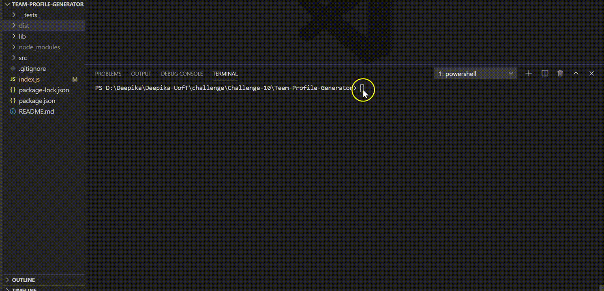

# Team-Profile-Generator
[](https://opensource.org/licenses/MIT)

## Description
An application that takes in information about employees on a software engineering team and generates an HTML webpage that displays summaries for each person.

## Table of Contents
* [Installation](#installation)
* [Usage](#usage)
* [Preview](#preview)
* [User Story](#userstory)
* [Acceptance Criteria](#acceptancecriteria)
* [Contributing](#contributing)
* [Questions](#questions)
* [Credits](#credits)

## Installation
1. Make sure Node.js is installed by running the below command in terminal. If not, install [Node.Js](https://nodejs.org/en/)
```
node -v
```
2. Clone this repo using ssh on your local machine.
```
git clone git@github.com:deepikabekal/README-Generator.git
```
3. Open terminal and make sure to cd to the root of the repo.
4. Open the repo in your text editor.
5. Install all the dependencies.
```
npm install
```

## Usage
1. In the text editor terminal run the following command
```
node index.js
```
2. Answer all the questions. 

## Preview


## User Story
```
AS A manager
I WANT to generate a webpage that displays my team's basic info
SO THAT I have quick access to their emails and GitHub profiles
```

## Acceptance Criteria
```
GIVEN a command-line application that accepts user input
WHEN I am prompted for my team members and their information
THEN an HTML file is generated that displays a nicely formatted team roster based on user input
WHEN I click on an email address in the HTML
THEN my default email program opens and populates the TO field of the email with the address
WHEN I click on the GitHub username
THEN that GitHub profile opens in a new tab
WHEN I start the application
THEN I am prompted to enter the team manager’s name, employee ID, email address, and office number
WHEN I enter the team manager’s name, employee ID, email address, and office number
THEN I am presented with a menu with the option to add an engineer or an intern or to finish building my team
WHEN I select the engineer option
THEN I am prompted to enter the engineer’s name, ID, email, and GitHub username, and I am taken back to the menu
WHEN I select the intern option
THEN I am prompted to enter the intern’s name, ID, email, and school, and I am taken back to the menu
WHEN I decide to finish building my team
THEN I exit the application, and the HTML is generated
```

## Contributing
1. Fork the repo.
2. Add feature or make changes.
3. Make a pull request for review.

## Credits
* [npm](https://docs.npmjs.com/) Documentation.
* [Inquirer](https://www.npmjs.com/package/inquirer) Package.
* [MDN Web Docs](https://developer.mozilla.org/en-US/) for Javascript Guide.

